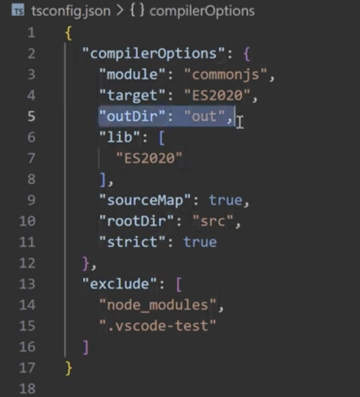
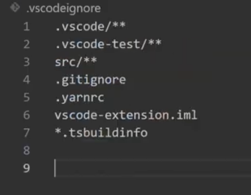

# vs extension
 
VSCode Extension API Docs
https://code.visualstudio.com/api


## tsconfig
needs 
- tsconfig.json

- .vscodeignore


## package.json
name
version
"scripts":{
  compile: "tsc -p ./"
}
// location of js code for extension
"main": "./out/extension.js"  
// version of vs code to run on 
 "engines":"^1.1.0" 
// defining what commands vs code can see
"contributes" {
    "commands":[
        {
          "command":"wrapSelections.tryCatch",
          "title":"Wrap selection in try/catch"
        }
    ]
}

// dev dependencies
// ide types
"devDependencies":{
    "@types/vscode": "^1.107.0",
    "@types/node@:"16.x"
    "typescript":"^4.9.4"
}


## terminal 
npx install

## create src/extension.ts
activate is triggered when started to load command as set in package.json

```json
import * as vscode from 'vscode';
export function activate (content:vscode.ExtensionContext) {
    const disposable = vscode.commands.registercCommand('wrapSelection.tryCatch',async () => {
        vscode.window.showInformationMessage("HELLO")
    })
    context.subscriptions.push(disposable)
}
```

## build extension.js
npm run compile 

## f5 to run window with extension installed
add debug point in code

## update command
 const editor=vscode.window.activeTextEditor;
 if (!editor) {
    vscode.window.showWarnginMEssage('no active editor')
    return;
 }

// get text that is selected in editor
 const selection = editor.selection
 const selected Text = editor.document.getText(selection);

...
const success = await editor.edit(editBuilder => {
    editBuilder.replace(selection,wrappedCode);
})

context.subscriptions.push(disposable)


## create visx

npm install -g @vscode//vsce
vsce package

package.json needs versino and repository


## load extension
tab
3 dot install from vsix
select file

cmd + shift + P  "wrapselect..."


## can publish
but not needed if loading from file

